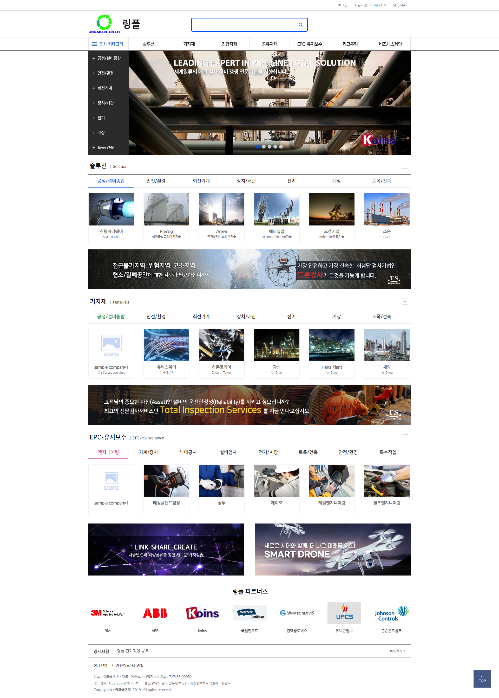
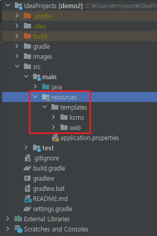
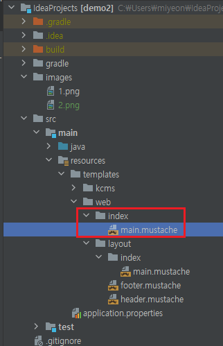

# LinkPlanTecDemo2
## 프로젝트 설명
스프링 부트학습 및 기존 링크플랜텍 개편작업
## 프로젝트 환경
* Java 8
* gradle 7.x
* Spring Boot 2.5.1
## 기타 프로젝트 환경
* mustache
* Intellij
## 프로젝트 메인 화면

## VIEW 작업장소

## 실질적 코딩장소

* web또는 kcms아래 layout을 제외한 곳에 작업한다.
* 기본 확장자는 기존에 *.jsp가 아닌 *.mustache
